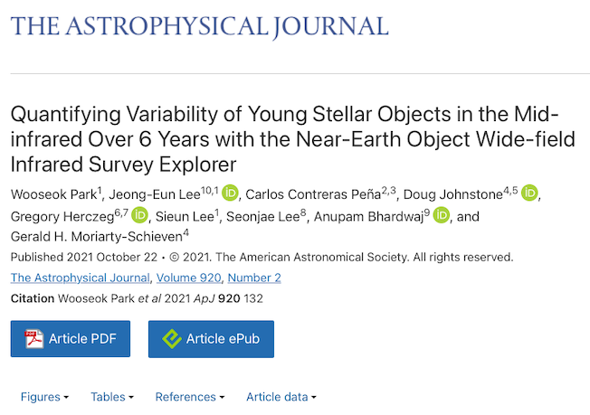
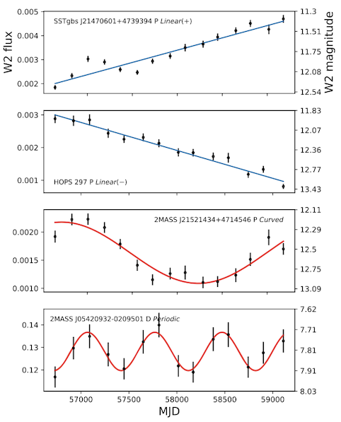
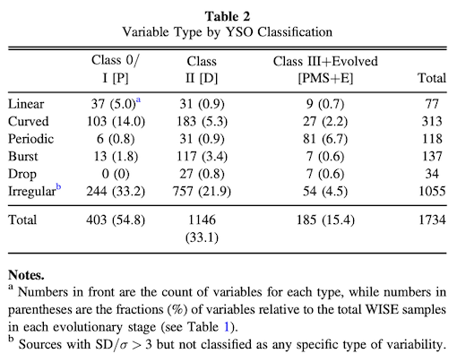
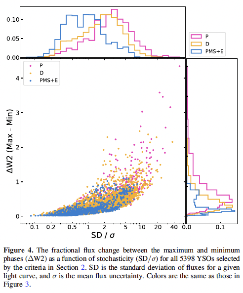

# NEOWISE Young Stellar Object variability analyses 

### 🔭 💫 우주망원경 WISE를 이용한 원시성 적외선 밝기 데이터 분석 프로젝트입니다. 

### 연구 결과는 논문으로 Astrophysical Journal에 기고하였습니다. [링크](https://ui.adsabs.harvard.edu/abs/2021ApJ...920..132P/abstract) 

연구 관련 데이터 분석은 python3로 진행되었으며, 간략한 분석 과정 튜토리얼을 [WISE YSO variability analysis_tutorial.ipynb](WISE YSO variability analysis_tutorial.ipynb) 에서 확인하실 수 있습니다. (현재 미완이며 업데이트 예정입니다.)

## Introduction - 연구 소개

약 50억년으로 추정되는 태양의 나이에 비해 원시성 (Young Stellar Objects, YSOs)은 태어난지 1000만년이 되지 않는 아주 어린 별이며, 아기가 쑥쑥 자라듯이 격렬한 질량 축적이 이루어지고 이 과정에서 **밝기가 빠르고 불규칙하게 변하는 특징**을 가지고 있습니다.

이러한 원시성의 밝기 변화를 통해 원시 항성계 혹은 태양계의 초기 생성 원리를 밝혀 내려는 연구가 비교적 최근부터 활발히 연구되어지고 있습니다. 본 연구에서는 알려진 5400개의 원시성의 밝기 변화를 적외선 우주망원경인 WISE의 NEOWISE 프로젝트 관측 시계열 데이터로 수집하였습니다.

수집한 시계열 데이터는 outlier 제거 등 분석에 용이한 형태로 정제하였고 이로부터 밝기의 변화량, 표준편차, 주기 등 각각 별에 대한 feature를 계산하였습니다. 

그 후, 계산된 feature들을 이용하여 별의 밝기변화 형태를 Linear, Curved, Periodic, Burst, Drop, Irregular (선형, 곡선형, 주기형, 폭발 - 순간적인 밝기 증가, 깜빡임 - 순간적인 밝기 감소, 불규칙) 의 6가지 형태로 분류하는 데 성공하였습니다.  
아래 그림은 Linear 증가, Linear 감소, Curved, Periodic 변화의 예를 보여줍니다.

각각의 **원시성의 진화 단계는 선행 연구들로 인해 알려진 상태**이기 때문에, 밝기 변화 분류 결과와 진화 단계를 비교하면 **진화 단계별 밝기 변화의 특징을 파악**할 수 있습니다.  
아래는 가장 초기 단계부터 Class 0/I - Class II - Class III 으로 나누어진 원시성 진화 단계별 변화 형태의 분포표입니다. 괄호 () 는 전체 샘플 대비 % 인데, Class 0/I 단계에서 밝기 변화율이 54.8%로 가장 큰 것을 알 수 있습니다.

아래 그림은 별 개개의 밝기의 분산 (클수록 밝기 변화의 정도가 크며 무질서함) 이 x축, 최대 밝기변화 폭이 y축인 그래프입니다. 가장 초기 단계인 P (Class 0/I, 빨간색) 가 가장 변화의 정도가 크고, 이후 진화 단계로 접어들수록 밝기 변화의 정도가 줄어드는 경향을 확인할 수 있습니다.

결론적으로, 본 연구를 통해 원시성 각각의 알려진 **진화 단계**와 새롭게 분류된 **밝기 변화 형태**를 비교 분석한 결과 **더 초기 단계의 원시성일 수록 크고 선형적인 밝기 변화를 보이는 것이 밝혀졌습니다.** 

